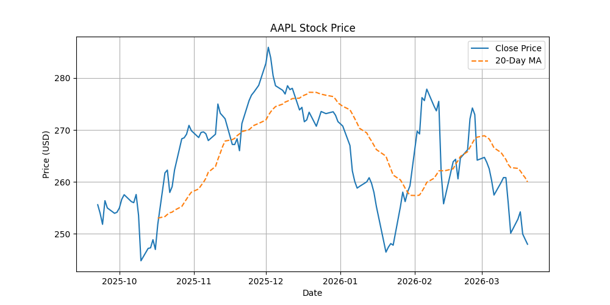

# Python stock market analyzer
An object-oriented Python tool designed to fetch stock market data, perform technical analysis and visualize price trends using real financial data from Yahoo Finance.
This project allows the user to enter a stock symbol (AAPL, GOOGL, ACN) and performs basic financial analysis such as returns, volatility and moving averages. It also generates a visualization of stock prices trend over the last 6 months.


## Built with

**Tech used:** Python, pandas, matplotlib, yfinance

To build this stock analyzer I created a class StockAnalyzer with severals methods in it. I used fetch_data to connect to the yfinance API  and get data from the it. The method calculate_daily_returns computes the percentage changes, calculate_moving_average performs a rolling mean (AM) and print_statistics outputs mean return and volatility. I used matplotlib to generate a time-series plot. 


## Getting started 

**Prerequisites**

Make sure you have:
- Python
- pip

**Installation**

1) Clone the repository
```bash
git clone https://github.com/satinerichard/stock-analyzer-python.git
cd stock-amalyzer-python
```

2) Install depedencies
```bash
pip install yfinance pandas matplotlib
```

**Usage**

1) Run the program
```bash
python3 main.py
```

2) Enter a stock symbol when prompted(e.g. AAPL, GOOGL)

3) The script will output statistics in the terminal and open a window with the plot.


## Example output

If the user enters AAPL, the program will output this in the terminal:

```text
Stock Analyzer starting...
Enter stock symbol (e.g., AAPL): AAPL
Data for AAPL fetched successfully.
Daily returns calculated.
20-day moving average calculated.
Average Daily Return: -0.0002
Volatility (Std Dev of Daily Returns): 0.0133
                                 Open        High         Low       Close     Volume  Dividends  Stock Splits  Daily Return  MA_20
Date                                                                                                                              
2025-09-22 00:00:00-04:00  247.827636  256.151782  247.647971  255.592819  105517400        0.0           0.0           NaN    NaN
2025-09-23 00:00:00-04:00  255.393222  256.850436  253.097595  253.945969   60275200        0.0           0.0     -0.006443    NaN
2025-09-24 00:00:00-04:00  254.734469  255.253485  250.562414  251.830002   42303700        0.0           0.0     -0.008332    NaN
2025-09-25 00:00:00-04:00  252.728292  256.680765  251.231145  256.381317   55202100        0.0           0.0      0.018073    NaN
2025-09-26 00:00:00-04:00  253.616601  257.109942  253.297202  254.974014   46076300        0.0           0.0     -0.005489    NaN
```

And this graph:



## What I learned

- Working with financial data in python
- Using APIs (Yahoo Finance via yfinance)
- Data visualization using matplotlib
- Data analysis using pandas
- Reinforced my understand of Object-oriented programming


## Future improvements

- Compare multiple stocks
- Add a user interface (GUI or web app)


